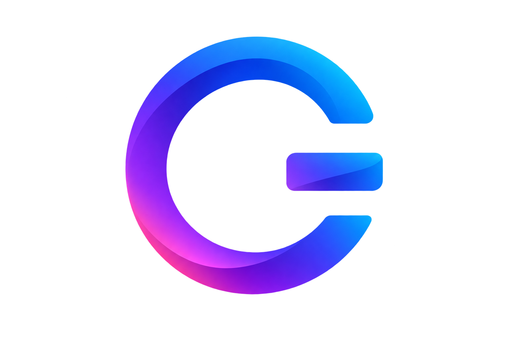

<p align="center">
  
</p>

<h1 align="center">OGE — Angular UI Components</h1>

<p align="center">
  Signal-based, zoneless Angular components engineered for data-heavy apps:<br />
  a virtualized <b>Data Grid</b>, <b>Tree List</b>, <b>Pivot Grid</b>, a full set of <b>form editors</b> (text, number,<br />
  select/tag/autocomplete, date, toggle), <b>Buttons</b>, <b>Modal</b> dialogs and <b>Toast</b> notifications.
</p>

<p align="center">
  <a href="https://ogeui.com"><b>ogeui.com</b></a> — docs, live demos &amp; API reference
</p>

<p align="center">
  <a href="https://www.npmjs.com/package/oge-ui"></a>
  <a href="https://www.npmjs.com/package/@oge-ui/grid"></a>
  <a href="https://github.com/oge-ui/oge-ui/actions/workflows/ci.yml"></a>
  <a href="LICENSE"></a>
  
</p>

---

## Why OGE?

- **Signals end to end** — every input, output and piece of state is a signal.
  No decorators, no lifecycle guesswork, full template type checking.
- **Zoneless by default** — no Zone.js, no global change-detection sweeps;
  components mark exactly what moved.
- **Built for serious data** — row _and_ column virtualization into the
  millions, server-side sort/filter/page/group, live push updates, infinite
  scrolling, CSV/Excel/PDF export.
- **Accessible by default** — WAI-ARIA grid and combobox semantics, full
  keyboard navigation, axe-tested docs pages.
- **Design-token theming** — one set of CSS variables drives every component;
  dark, Tailwind and Bootstrap bridges ship in the box.
- **Zero runtime dependencies** — the only hard dependency between packages is
  OGE's own framework-free core. Export libraries (`exceljs`, `jspdf`) are
  optional peers: never installed, bundled or executed unless you opt in.

## Installation

Everything at once:

```sh
npm install oge-ui
```

…or à la carte — every package is standalone:

```sh
npm install @oge-ui/grid        # data grid (+ @oge-ui/core)
npm install @oge-ui/tree-list   # hierarchical grid
npm install @oge-ui/buttons     # buttons, groups, drop-downs (+ @oge-ui/overlay)
npm install @oge-ui/inputs      # text, number, select, tag, date and toggle editors
npm install @oge-ui/pivot       # pivot table (commercial — see Licensing)
```

## Quick start

```ts
import { Component, signal } from '@angular/core';
import { OgeButton, OgeColumn, OgeGrid, OgeSelectBox } from 'oge-ui';

@Component({
  selector: 'app-orders',
  imports: [OgeGrid, OgeColumn, OgeSelectBox, OgeButton],
  template: `
    <oge-select-box label="Region" [items]="regions" [searchEnabled]="true" [(value)]="region" />

    <oge-grid [data]="orders()" keyField="id" [filterRow]="true">
      <oge-column field="product" caption="Product" />
      <oge-column field="amount" caption="Amount" dataType="number" />
    </oge-grid>

    <oge-button text="Save" severity="accent" [action]="save" />
  `,
})
export class Orders {
  readonly regions = ['EMEA', 'APAC', 'Americas'];
  readonly region = signal<unknown>(null);
  readonly orders = signal([{ id: 1, product: 'Aurora Display', amount: 1249 }]);

  // async action: the button manages its own loading spinner
  readonly save = () => fetch('/api/orders', { method: 'POST' });
}
```

No modules, no forms boilerplate — `[(value)]` binds straight to a
`signal()`, and the same editors also plug into Signal Forms
(`[formField]`) and reactive forms (`formControl`).

## Packages

All packages are MIT except `@oge-ui/pivot`, which is commercial (free for
evaluation and development) — see [Licensing](#licensing).

| Package                                   | Description                                                                                | npm                                                    |
| ----------------------------------------- | ------------------------------------------------------------------------------------------ | ------------------------------------------------------ |
| [`oge-ui`](packages/ui)                   | **Umbrella**: one install + one import path for the whole MIT suite                        | [npm](https://www.npmjs.com/package/oge-ui)            |
| [`@oge-ui/grid`](packages/grid)           | Virtualized Data Grid: sorting, filtering, grouping, editing, master-detail, export        | [npm](https://www.npmjs.com/package/@oge-ui/grid)      |
| [`@oge-ui/tree-list`](packages/tree-list) | Hierarchical grid: lazy loading, tri-state selection, drag & drop                          | [npm](https://www.npmjs.com/package/@oge-ui/tree-list) |
| [`@oge-ui/pivot`](packages/pivot)         | Pivot Grid (commercial): rows × columns × measures, totals, two-axis virtualization        | [npm](https://www.npmjs.com/package/@oge-ui/pivot)     |
| [`@oge-ui/buttons`](packages/buttons)     | Buttons, groups & drop-down/split buttons: async actions, click guards, hold-to-confirm    | [npm](https://www.npmjs.com/package/@oge-ui/buttons)   |
| [`@oge-ui/inputs`](packages/inputs)       | Form editors: text, textarea, number, select/tag/autocomplete, date, checkbox/switch/radio | [npm](https://www.npmjs.com/package/@oge-ui/inputs)    |
| [`@oge-ui/overlay`](packages/overlay)     | Anchored popups, menus, tooltips, context menus, modal dialogs and toasts                  | [npm](https://www.npmjs.com/package/@oge-ui/overlay)   |
| [`@oge-ui/core`](packages/core)           | Framework-free data engine: data sources, filtering, pivot math, virtualization            | [npm](https://www.npmjs.com/package/@oge-ui/core)      |

## Theming

Every component reads one set of CSS design tokens — override them anywhere
in the cascade:

```css
:root {
  --oge-accent: #6366f1;
  --oge-radius: 8px;
}
```

Bundled themes: **dark** (`.oge-theme-dark` on any ancestor), **Tailwind** and
**Bootstrap** bridge stylesheets. See the
[styling guide](https://ogeui.com/getting-started/styling).

## Localization

All user-facing strings (including aria labels) live in per-package message
catalogs — override globally with `provideOge<X>Config()` or per instance via
`[messages]`. See the
[localization guide](https://ogeui.com/getting-started/localization).

## Compatibility

| OGE | Angular | Notes                                    |
| --- | ------- | ---------------------------------------- |
| 0.x | ≥ 22    | standalone components, signals, zoneless |

## Contributing

This is an Nx workspace:

```sh
npm ci
npx nx serve dev-app          # docs site on http://localhost:4200
npx nx run-many -t test       # vitest suites
npx nx run-many -t lint build # what CI runs
```

Architecture and house conventions live in
[`docs/ARCHITECTURE.md`](docs/ARCHITECTURE.md); feature-parity tracking in
[`ROADMAP.md`](ROADMAP.md). Please read
[`CONTRIBUTING.md`](CONTRIBUTING.md) before opening a PR; security issues go
through [`SECURITY.md`](SECURITY.md), and the
[code of conduct](CODE_OF_CONDUCT.md) applies in all project spaces.

## Licensing

OGE UI is **open-core**:

- **MIT — free forever.** `oge-ui`, `@oge-ui/core`, `@oge-ui/grid`
  (including Excel/PDF export, master-detail and server-side operations),
  `@oge-ui/tree-list`, `@oge-ui/inputs`, `@oge-ui/buttons` and
  `@oge-ui/overlay` are [MIT-licensed](LICENSE). This is a commitment:
  these packages and every feature currently in them will remain MIT.
- **Commercial — `@oge-ui/pivot`.** The pivot grid is source-available
  commercial software: free for evaluation, development and testing;
  production use requires a paid license
  ([packages/pivot/LICENSE](packages/pivot/LICENSE),
  [ogeui.com/license](https://ogeui.com/license)). Future analytics-oriented
  packages (e.g. charts) may join this tier — never anything that is MIT
  today.
